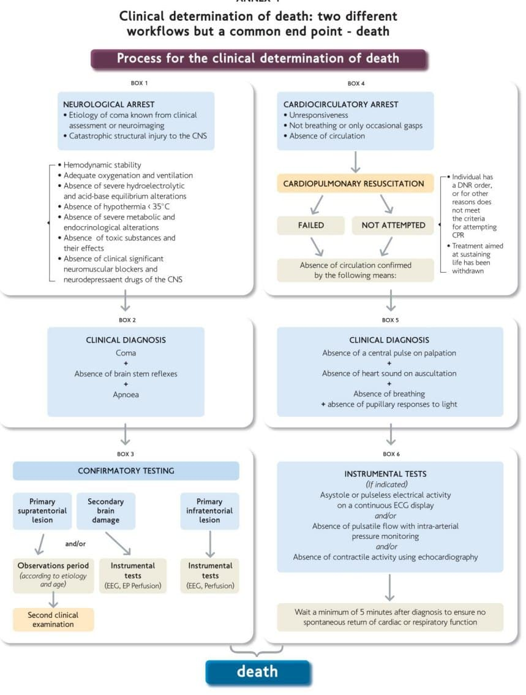

# Terapi Tipikal di UGD

Pada bagian ini akan diisi dengan pola tatalaksana sering diberikan pada pasien di UGD. Tatalaksana dikelompokkan berdasarkan kategori kasus. Dosis obat dibuat berdasarkan pengalaman penyusun atas dasar pengetahuan dan instruksi dokter spesialis.

## UGD - Rawat Jalan (General Practitioner)
### Diare Anak
**VIRAL DIARHEA**

* Interlac 1 x 1 sach atau L-bio 1 x 1 sach sesuaikan dosis
* Parasetamol 10-15 mg/kg BB tiap 6-8 jam, sesuaikan dengan suhu dan sediaan yang efektif.
* Zinc 1 x 20 mg (jika usia >6 bulan) atau 1 x 10 mg (jika usia <6 bulan)
* Antiemetik suportif. Domperidon 0,2-0,5 mg/kgBB/kali tiap 4-8 jam (PO) atau ondasetron 0.1-0.2 mg/kg tiap 6-12 jam (PO).

**BACTERIAL DIARHEA**

* Antibiotics golongan penisilin atau cefalosporin

------------------------------------------------------------------------

## Penyakit Dalam

### Endokrinologi

#### Hiperglikemia preoperasi

#### Ketoasidosis Diabetikum (KAD)

DKA biasanya disertai hiperkalemia akibat shoft K keluar sel. Jika sebaliknya DKA dengan kalium normal atau hipokalemia, maka curigai adanya kekurangan total kalium tubuh.

#### Hyperglicemic Hyperosmolar State

### Nefrologi

#### Hiperkalemia (K > 5,5 mEq/L)

Ancaman utama adalah gangguan polarisasi jantung (menjadi kurang elektronegatif), risiko aritmia tinggi.

* Hiperkalemia ringan 5,0 - 5,9 mEq/L
* Hiperkalemia sedang 6.0 - 6.4 mEq/L
* Hiperkalemia berat $\geq$ 6.5 mEq/L

**Terapi**

* Monitor EKG kontinyu.

**1. Tahap 0 ~ stop intake kalium**

* Berikan infus NaCl, jika sebelumnya RL, maka diganti dengan NaCl.
* Hentikan suplemen atau makanan yang tinggi kalium.
* Hentikan obat yang menghambat eksresi kalium di ginjal secara langsung (ACE inhibitor, ARB, K sparing diuretics) dan tidak langsung (NSAID, iodine kontrast, antibiotik).

**2. Tahap 1 ~ stabilkan membran sel jantung**

* Berikan kalsium, biasanya dalam bentuk sediaan kalsium glukonat (melawan efek hiperkalemia dalam tingkat membran sel, menstabilkan jantung). Calcium glukonat (10%) 10-20 ml (IV) / 1 ampul atau calcium chloride (10%) 5-10 ml (IV) sebaiknya via vena sentral. Onset 3-5 menit, lama kerja 30-60 menit

**3. Tahap 2 ~ Shift K kedalam sel (penurunan $\pm$ 1,2 mEq/L)**

* Albuterol atau salbutamol nebul (beta-2 agonist) dosis tinggi (4 kali dosis bronkodilasi), 10-20 mg dalam 4 ml NS, nebul dalam 10 menit. Penurunan sekitar 0,5 - 1 mEq/L, tergantung dosis. Onset 15-30 menit, lama kerja 2-4 jam.
* Insulin dan glukosa. 5-10 Unit insulin IV dengan glucose 25 gram (50%) IV. Atau alternatif yang lebih sering digunakan adalah 4 flakon D40% masukan dalam D10% 100 ml hingga total 200 cc. Kemudian ditambahkan 20 unit insulin. Campuran Infus dihabiskan dalam 30 menit. Pada pasien hiperglikemia tidak diberikan glukosa. penuruna maksimal 0,6 mEq/L. Onset 30 menit, lama kerja 4-6 jam.
* Jika tidak ada tanda overload cairan, berikan loading cairan (100-250 ml).

**4. Tahap 3 ~ Maksimalkan eksresi Kalium**

* Furosemid 40-80 mg IV (eksresi via renal)
* Sodium Polystiren Sulfonate (Kayexalate) 25-50 mg PO atau PR untuk membantu eksresi via saluran cerna. Onset 1-2 jam, lama kerja 4-6 jam.


**Pertimbangkan**
 
* Natrium bicarbonate 50 - 100 ml untuk membantu shift K, masih kontroversial. Berikan hanya jika ada metabolic acidosis berat.
* Hemodialisis Cito, terutama jika pasien sudah memiliki riwayat CKD. Penurunan 1 mEq/L dalam 1 jam pertama, dan 1 mEq/L dalam 2 jam selanjutnya. Pada fungsi ginjal normal, obat-obatan saja biasanya cukup.
* Epinefrine, pada keadaan cardiac arrest akibat hiperkalemia. Penurunan 0,25 mEq/L. 

#### Hipokalemia (K < 3,5 mEq/L)

Ancaman utama adalah gangguan polarisasi jantung (menjadi lebih elektronegatif), risiko aritmia tinggi. Setiap penurunan kalium serum 0,3 mEq/L dibawah normal setara dengan defisit 100 mEq total kalium tubuh. 

**Terapi**

**1. Hipokalemia Ringan (K > 3,0 mEq/L)**

Koreksi oral:

* Terapi penyebab utama. Jika ada penggunaan diuretik (furosemid atau thiazide), maka dapat dikurangi dosis atau tambahkan spironolakton sebagai pengganti. Jika akibat respiratory alkalosis (ansietas akut/hiperventilasi), maka terapi penyakit dasar/gejala saja cukup tanpa suplementasi K. Jika pasien menggunakan beta agonist (asma atau PPOK) maka penurunan kalium bisa terjadi akibat dosis beta agonist yang besar, walaupun penurunan K bersifat sementara.
* Makanan kaya kalium (buah, sayur)
* Suplement tablet garam, atau suplemem K. Suplemen disertai KIE minum yang banyak, untuk mencegah iritasi lambung. Suplemen K 40 -100 mEq/hari untuk koreksi sedangkan 20 meq/hari untuk pencegahan. Maksimal 40meq per kali. Dosis pencegahan 1 mEq/kgBB hingga 3 mEq/kgBB per hari, sedangkan untuk pengobatan 2–4 mEq/kgBB per hari. KSR 600 mg mengandung 8 meq K. 1-2 tablet 2-3 kali/hari.

Jika pasien ada gejala mual dan muntah, maka koreksi oral tidak akan efektif. 

**2. Hipokalemia Sedang (K 2,5 - 3,0 mEq/L)**

Gejala akan muncul jika pasien memiliki riwayat jantung

* Koreksi kalium intravena dengan kalium chlorida dengan konsentrasi maksimal 40 mEq dalam 500 mL NaCl selama 4-6 jam agar tidak mengiritasi vena. Jika koreksi agresif diperlukan, maka dapat diberikan dari 2 line IV perifer atau satu jalur IV sentral. Laju koreksi 10-20 mEq/jam Maksimal koreksi tidak melebihi 20 mEq/jam. 

**3. Hipokalemia Berat (K < 2,5 mEq/L)** 

Pada tingkat kalium <2,5 mEq/L, pada pasien tanpa kelainan jantung gejala klinis baru muncul. 

* Sama dengan hipokalemia sedang

**Pertimbangkan**

Pada sebagian kasus hipokalemia disertai dengan hipomagnesemia. Biasanya terjadi pada kasus hipokalemia yang sulit dikoreksi dan berat. Berikan magnesium (20 hingga 60 mEq/24 jam). Satu gram MgSO4 setara 4 mmol atau 8 mEq magnesium, sehingga diperlukan 2,5-6 gram. Satu fls MgSO4 20% = 5 gram MgSO4 dan 1 fls MgSO4 40% = 10 gram MgSO4. 
 
#### Hipernatremia (Na > 145 mEq/L)

Hipernatremia jarang terjadi, biasanya dialami pasien dengan kesulitan minum (bayi, lansia, bed rest, intubasi, kelainan mental) atau kehilangans sensasi haus. Hipernatremia biasanya terjadi akibat kelainan fisiologi dengan pasangan:

1. Dehidrasi dengan total Na tubuh rendah
2. Dehidrasi dengan total Na tubuh normal
3. Tanpa dehidrasi dengan total Na tubuh meningkat

Sebagian besar terjadi karena free water defisit. Untuk koreksi free water defisit maka diperlukan perhitungan:

\begin{equation}
\ TBW defisit = TBW \times [\frac{Serum NA}{140} - 1]
\end{equation}

TBW atau total body water dihitung dengan rumus:

\begin{equation}
\ TBW = BB (Kg) \times 0,6
\end{equation}

Untuk anak-anak dan laki-laki dewasa digunakan faktor pengali 0,6 L/Kg, wanita dewasa dan lansia pria 0,5 L/Kg serta lansia wanita 0,45 L/Kg.

**Terapi**

Koreksi dilakukan dengan laju:
* 1 -2 mEq/jam untuk kasus hipernatremia akut
* 0,5 mEq/jam atau 10 - 12 mEq/hari. untuk hipernatremia yang terjadi dalam kurun hari hingga minggu.

1. Terapi dilakukan dengan normal saline untuk koreksi dehirasi dan tanda vital stabil.
2. Jika diperlukan, setelah dehidrasi teratasi dapat diganti dengan D5 1/2 NS 100 ml/jam.
3. Jika pasien sadar, 2/3 cairan (water) dikoreksi melalui oral intake, 1/3 melalui IV

**Contoh**

Pasien laki laki dewasa, serum natrium 160 mEq/L, akibat muntah muntah dan penurunan kesadaran selama 7 hari. BB 50 kg.

\begin{equation}
\ TBW = BB (Kg) \times 0,6 L/Kg
\end{equation}
\begin{equation}
\ TBW = 50kg \times 0,6 
\end{equation}
\begin{equation}
\ TBW = 30 L
\end{equation}
\begin{equation}
\ TBW defisit = TBW \times [\frac{Serum NA}{Target NA} - 1]
\end{equation}
\begin{equation}
\ TBW defisit = 30 L \times [\frac{160}{140} - 1]
\end{equation}
\begin{equation}
\ TBW defisit = 30 L \times [1.14 - 1]
\end{equation}
\begin{equation}
\ TBW defisit = 30 L \times 0.14
\end{equation}
\begin{equation}
\ TBW defisit = 4.2 L
\end{equation}

Koreksi dilakuian 0,5 mEq/jam, maka:

\begin{equation}
\ lama koreksi = \frac{(160 mEq - 140 mEq)}{0.5 mEq/jam}
\end{equation}
\begin{equation}
\ lama koreksi = \frac{20 mEq}{0.5 mEq/jam}
\end{equation}
\begin{equation}
\ lama koreksi = 40 jam
\end{equation}

Maka kecepatan infus:

\begin{equation}
\ kecepatan = 4200 ml/40 jam
\end{equation}
\begin{equation}
\ kecepatan = 105 ml/jam
\end{equation}
\begin{equation}
\ kecepatan = \frac{ 105 ml/jam}{60 menit} \times 20 tetes/menit 
\end{equation}
\begin{equation}
\ kecepatan = 35 tpm
\end{equation}

#### Hiponatremia (Na < 135 mEq/L)

Hiponatremia menyebabkan edema sel, terutama pada sel saraf otak dan dapat menyebabkan edema serebri. 

Hiponatremia sering asimtomatik. Hipoenatremia yang memerlukan terapi segera adalah:
1. Asimptomatik dengan Na $\leq$ 110 mEq/L
2. Hiponatremia akut dan simptomatik (neurological deficit) dengan $\leq$ 110 mEq/L

Rumus perkiraan kenaikan Na dalam 1 liter infus.

\begin{equation}
\ \triangle Na = \frac{Na Infus - Na Serum}{TBW + 1}
\end{equation}

**Terapi**
Laju Koreksi:
* Hiponatemia akut (<48 jam), koreksi maksimal 10-12 mEq dalam 24 jam pertama
* Hiponatemia kronik (>48 jam), koreksi maksimal 8 mEq dalam 24 jam pertama
* Koreksi selanjutnya dilakukan dalam 48-72 jam.
* Koreksi cepat dapat dilakukan dengan  4-6 mEq dalam 6 jam ~ infus cepat NaCl 3% 100 ml dalam 10 menit, bisa diulang dengan 100 ml dalam 50 menit.
* Batasi intake cairan air murni.

**Contoh**

Pasien laki laki 50 th, BB sebelumnya 50 kg, Na 110 mEq/L, mual muntah serta diare sejak 5 hari.

* Koreksi hemodinamik dengan NaCl 0,9% (Na 154 mEq/L).
* Koreksi Na dengan NaCl 3% (Na 512 mEq/L).

TBW dihitung:
\begin{equation}
\ TBW = 50 kg \times 0.6 = 30 L
\end{equation}

Koreksi 1 L NaCl 3% menghasilkan perubahan Na serum sebesar:

\begin{equation}
\ \triangle NA = \frac{512 - 110}{30 + 1}
\end{equation}

\begin{equation}
\ \triangle NA = \frac{402}{31}
\end{equation}


\begin{equation}
\ \triangle NA = 13 mEq/L
\end{equation}

Koreksi maksimal dalam 24 jam adalah 8 mEq/24 Jam (hiponatemia kronis)


Na3% = $\frac{8 mEq/24 jam}{13 mEq/L}$


Na3% = $\frac{0.62 L}{24 jam}$


Laju infus:


Na3% = $\frac{620 ml}{24 jam}$


Na3% = $\frac{25.8 ml}{1 jam} = 8,6 tpm$


### Infeksi

### Pulmonologi

### Gastroenterologi & Hepatologi

### Kardiovaskular

#### Edema Paru Akut (Cardiogenic or Renal Cause)

-   Suplementasi oksigen (jika SpO2 \<92%) dengan NRM hingga target O2 92-96% dengan posisi Semifowler atau Fowler.
-   IVFD NaCl \~ 8 tpm
-   Ranitidin 50 mg tiap 12 jam (Standard Gastroprotector) atau alternatifnya
-   Furosemid Bolus 2,5 x dosis oral maintenance pasien. Jika belum pernah mengkonsumsi furosemid, 40 mg bolus cepat, maksimal awal 80 mg bolus (jika fungsi ginjal normal). Dosis lebih tinggi dibutuhkan jika terdapat penurunan fungsi ginjal.
-   Lanjut Drip furosemid (SP) dosis awal 3 mg/jam, target 5 mg/jam hingga 10 mg/jam
-   ISDN 5 mg Sublingual atau drip ISDN dosis mulai 1 mg/jam hingga 10 mg/jam (vasodilator), jika SBP\>90 mmhg
-   Captopril 25 mg Sublingual atau terapi antihipertensi lainnya untuk menurunkan preload, target
-   Konsultasi apakah diperlukan HD Cito (CR \> 5)
-   Terapi Kelainan elektrolit

**Bahan Pertimbangan**

-   IV morfin 1-2,5 mg bolus (menurunkan SVR) tetapi saat ini kontroversial. Pertimbangkan jika terdapat nyeri dada resistent pemberian nitrat. Monitor kesadaran dan usaha napas.
-   Jika terjadi hipoperfusi atau hipotensi, berikan inotropik (Dobutamin, Dopamin). Jika ada VT atau AF RVR jangan gunakan dobutamin.
-   Konsultasi ICU dan Intubasi jika diperlukan (SpO2 \<92% jika sudah NRM 15 LPM). CPAP 10 cm H20 + BiPAP 10/4 cm H20.
-   ACE Inhibitor mulai 24-48 jam pasca admisi
-   Stop NSAID, Verapamil dan Diltiazem.

### Imunologi

------------------------------------------------------------------------

## Paru

### Infeksi

#### Tuberculosis

#### COVID-19

#### Pneumonia Bacterial

### Obstruksi

#### PPOK

#### Asthma

### Malignancy

### Lain-lain

#### Efusi Pleura

------------------------------------------------------------------------

## Pediatri

### Neonatologi

### Infeksi

### Pulmonologi

#### Bronkopneumonia

-   Cairan D5 1/2 NS atau D5 1/4 NS sesuai maintenance
-   Cefotaxim 50 mg/kg/kali tiap 12 jam atau seftriakson 100 mg/kg/hari dibagi 2 dosis
-   Nebul salbutamol (0,1-0,15 mg/kg/kali) + 2 cc NaCl tiap 6 jam

### Gastroenterologi & Hepatologi

#### Diare Akut
**VIRAL DIARHEA**

* Interlac 1 x 1 sach atau L-bio 1 x 1 sach sesuaikan dosis
* Parasetamol 10-15 mg/kg BB tiap 6-8 jam, sesuaikan dengan suhu dan sediaan yang efektif.
* Zinc 1 x 20 mg (jika usia >6 bulan) atau 1 x 10 mg (jika usia <6 bulan)
* Antiemetik suportif. Domperidon 0,2-0,5 mg/kgBB/kali tiap 4-8 jam (PO) atau ondasetron 0.1-0.2 mg/kg tiap 6-12 jam (IV atau PO)

**BACTERIAL DIARHEA**

* Antibiotics golongan penisilin atau cefalosporin

**Cairan**

* Tanpa dehidrasi-dehidrasi ringan
* Dehidrasi Ringan-Sedang
* Dehidrasi Berat-shock

------------------------------------------------------------------------

## Kardiovaskular

### Pre-operative

### Iskemia

### Disritmia/Aritmia

### Heart Failure

### Vaskular Perifer

------------------------------------------------------------------------

## Bedah Umum

------------------------------------------------------------------------

## Bedah Digestif

### Obstruksi

------------------------------------------------------------------------

## Bedah Urologi

### Infeksi

### Obstruksi

### Malignancy

------------------------------------------------------------------------

## Bedah Ortopedi

### Preoperative

### Trauma

### Malignancy

------------------------------------------------------------------------

## Anestesi

### Preoperative

### Terapi Intensif
### Pain Control in ICU

* Target BPS $\leq$ 5

#### Opioid
##### Fentanil

* Onset cepat (1-2 min), risiko hipotensi tidak ada karena tidak menstimulasi pengeluaran histamin dan tanpa perlu penyesuaian dosis pada gagal ginjal

* Dosis loading dan bolus
0,35 - 0,5 mcg/kg tiap 0,5 - 1 jam

* Dosis Maintenance
0,7 -10 mcg/kg/jam

##### Morphine
* Onset cepat (5-10 min), risiko hipotensi ada karena menstimulasi pengeluaran histamin serta penyesuain dosis 50% pada gagal ginjal

* Dosis loading dan bolus
2 -4 mg, tiap 1-2 jam 

* Dosis Maintenance
2-30 mg/jam

#### Non-opioid (Opioid sparring effect)
##### Ketorolac
##### Paracetamol/acetaminopen

### Sedation in ICU
#### Benzodiazepine
* Ada akumulasi obat dan metabolitnya, untuk menghindari dapat dilakukan daily interuption (sampai pasien terbangun)
* Titrasi dosis hingga sedasi optimal (RASS scale 2)

##### Midazolam
Obat onset cepat (1-2 min) kerja pendek (1-2 jam) dan metabolit akumulatif. Batasi $\leq$ 48 jam.

Bisa mulai 2 mg bolus, drip 2 mg/jam

* loading dose
0,01 - 0,05 mg/kg

* Maintenance dose
0,02-0,1 mg/kg/jam

##### Lorazepam
Obat onset lambat (15-20 min), durasi sedang (2-6 jam)

* Loading Dose
0,02 - 0,04 mg/kg ($\leq$ 2 mg)

* Maintenance Dose (drip)
0,01 - 0,1 mg/kg/jam($\leq$ 10 mg)

* Maintenance Dose (intermitent bolus)
0,02 - 0,06 mg/kg, q 2-6 jam

#### Propofol

* Gunakan ketika durasi pendek (arousal 10-15 min pasca henti drip) dan cepat (1-2 min).
* Gunakan hanya pada pasien yang dalam bantuan ventilator (risiko depresi nafas)
* Gunakan hanya pada pasien dengan hemodinamik stabil atau tanpa hipovolemia atau gagal jantung

* Dosis loading
5 mcg/kg/min dalam 5 menit

* Dosis Maintenance (drip)
5-50 mcg/kg/min

### Glucose Control in Critically Ill

#### Texas Protocol

* Target 80 - 140 mg/dL
* Pasien memiliki riwayat diabetes melitus

Tata Cara:

1. Siapkan infus insulin dengan syringe pump, 50 unit dalam 50 cc NS (1 unit/cc) atau jika tanpa syringe pump dengan NS 100 cc + 100 Unit Insulin. Insulin yang digunakan adalah insulin rapid/short acting (Aspart/glulisin) atau regular insulin.

2. Hitung dosis awal dan bolus dengan membagi kadar glukosa dengan angka 100, bulatkan hasilnya ke 0,5 terdekat. Hasil perhitungan menjadi dosis Bolus IV dan laju infus unit/jam.

**Contoh**

*contoh 1*
Jika glukosa awal 326 mg/dl, maka 326/100 = 3,26. Bulatkan ke 0,5 terdekat, menjadi 3,5 unit. Maka bolus 3,5 unit dan jalanan infus dengan laju 3,5 unit/jam. 

*contoh 2*
Jika glukosa awal 173 mg/dl, maka 174/100 = 1,74. Bulatkan ke 0,5 terdekat menjadi 1,5. Maka bolus 1,5 unit + infus 1,5 unit per jam.


### Intubasi (invasive ventilation)

### Ventilator

------------------------------------------------------------------------

## Neurologi & Bedah Saraf

### Vaskular

#### Stroke non Hemorhagik (SNH)

-   IVFD NaCL 0,9% 24 tpm \~ sesuai keadaan klinis
-   Loading Aspirin 320 mg atau Proxime (aspirin + Glisin) 300 mg, lanjut 80 mg tiap 24 jam atau proxime 100 mg tiap 24 jam peroral
-   Citicolin 500 mg (IV) tiap 12 jam
-   Mecobalamin 500 mcg (IV) tiap 12 jam
-   Ranitidin 50 mg tiap 12 jam atau gastroprotector lain
-   Candesartan 8 mg tiap 24 jam (PO) atau antihipertensi lain
-   Rawat Stroke Unit jika ada
-   KIE harus bedrest, tidak boleh ngeden. Jika konstipasi dapat diberikan laktulosa 5 ml tiap 8 jam.
-   Pertimbangkan pasang DC dan NGT

#### Stroke Hemorhagik (SH)

-   IVFD NaCL 0,9% 24 tpm \~ sesuai keadaan klinis
-   Citicolin 500 mg (IV) tiap 12 jam
-   Mecobalamin 500 mcg (IV) tiap 12 jam
-   Ranitidin 50 mg tiap 12 jam atau gastroprotector lain
-   Kontrol Tekanan darah
-   Rawat ICU atau stroke unit
-   Pertimbangkan pasang DC dan NGT
-   Jika terjadi edema cerebri dan tanda peningkatan TIK, maka berikan Manitol bolus 200 cc, lanjut 100 cc tiap 6 jam.

### Pain

### Trauma

### Malignancy

### Degenerative

------------------------------------------------------------------------

## Obstetri & Gineklogi

### Obstetri

### Ginekologi

------------------------------------------------------------------------

## Dermatologi & Venereologi

### Psoriasis

### Alergi

------------------------------------------------------------------------

## THT

### Preoperaitve

### Corpus Alienum

### Infeksi

### Tumor

------------------------------------------------------------------------

## Mata

### Preoperative

### Infeksi

### Corpus Alienum

### Trauma

------------------------------------------------------------------------

## Psikiatri

### Raptus (mengamuk)

------------------------------------------------------------------------

## Forensik & Medikolegal

### DOA

#### Penegakan Diagnosis Kematian

**Tanda Pasti Kematian [(Obvious clinical signs of irreversible death)][1]:**

- Rigor mortis

- Dependent Lividity

- Decapitasi

- Transection

- Decomposition

**Tanda Klinis Kematian:**

Penentian kematian berdasarkan tanda klinis kematian dilakukan jika tidak ditemukan tanda pasti kematian. Tanda klinis kematian dapat ditentukan dari 2 pintu masuk, yaitu *Cardiocirculatory Death* dan *Neurological Death* berdasarkan pedoman [WH0][2].

**A. Circulatory Death:**

1. Tidak respon 

2. tidak ada napas atau hanya *gasping*

3. tidak ada sirkulasi (nadi)

Jika ditemukan tanda diatas, maka dilakukan resusitasi jantung paru (Cardiopulmonary Resuscitation) atau jika pasien sudah memiliki tanda DNR, maka resusitasi tidak perlu dilakukan.

Tahap selanjutnya adalah melakukan konfirmasi ketiaadaan sirkulasi (absence of circulation) dengan pemeriksaan klinis meliputi:

1. Tidak ada pulsasi nadi sentral

2. Tidak ada suara jantung pada auskultasi jantung

3. Tidak ada usaha napas

4. Tidak ada respon pupil dengan pencahayaan (absence of pupillaru response to light)

Tahap selanjutnya adalah melakukan salah satu pemeriksaan penunjang jika fasilitas tersedia untuk mencari tanda:

1. Asistol atau PEA dari EKG dan/atau

2. Ketiadaan pulsasi dari pemantauan *intraarterial preassure monitoring* dan/atau

3. Ketiadaan aktivitas kontraktil dari echocardiography

**B. Neurological Death**

Tanda brain death harus dicari terutama ketika tanda circulatory arrest tidak dapat ditemukan:

1. Coma

2. Cedera katastropik pada CNS

Tahap selanjutnya adalah melakukan konfirmasi ketiaadaan aktivitas otak dengan pemeriksaan klinis meliputi:

1. Tanda klinis Coma

2. Tidak adanya reflex batang otak

3. Apneu test

```{r Death, echo=FALSE, fig.align='center', fig.height=12, fig.width=8, message=TRUE, warning=TRUE}

```


## Persiapan Pemeriksaan Penunjang

### Radiologi

#### USG Abdomen Atas Bawah

#### USG Urologi

#### CT Stonografi

### Laboratorium

#### Asam Urat

#### Lipid Profil

------------------------------------------------------------------------
